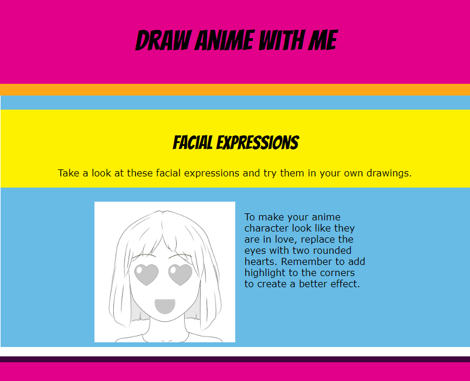

## Introduction

In this project, you will create and style a webpage for an anime drawing tutorial. 

**Hypertext Markup Language (HTML)** is used to structure a webpage. **Cascading Style Sheets (CSS)** describes exactly how a webpage should look. Without CSS, a webpage would look really boring.

You will:
+ Use **HTML** tags to structure a webpage
+ Use **CSS** styles to apply layouts, colour palettes, and fonts to your webpage
+ Add images and text content to your webpage

A **web designer** is someone who plans and designs webpages. There are hundreds of millions of active webpages, so if you use HTML with CSS, it can help your webpage attract people's attention. 

**Tip:** Drag the scroll bar down to see the full webpage. 

--- no-print ---
--- task ---
### Try it

  
Explore the anime expressions webpage. Can you spot things on this webpage that you have seen on other webpages?

<iframe src="https://staging-editor.raspberrypi.org/en/embed/viewer/anime-expressions-complete" width="600" height="600" frameborder="0" marginwidth="0" marginheight="0" allowfullscreen> </iframe>

--- /task ---
--- /no-print ---

--- print-only ---

--- /print-only ---

