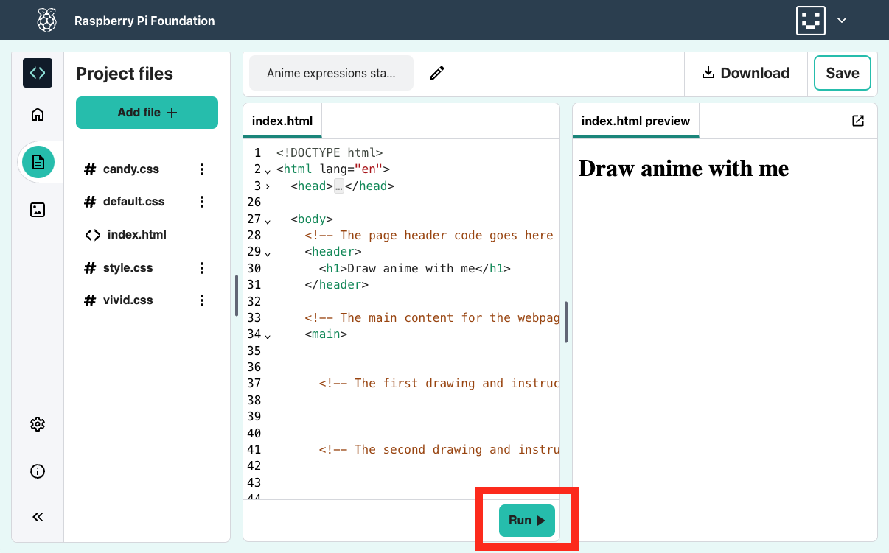

## Start your webpage

In this step, you will add a header and an introduction to your anime webpage.
In HTML you can type words directly to appear on the webpage.

<iframe src="https://staging-editor.raspberrypi.org/en/embed/viewer/anime-expressions-step-2" width="500" height="400" frameborder="0" marginwidth="0" marginheight="0" allowfullscreen> </iframe>

--- task ---

Open the [Anime expressions starter project](https://staging-editor.raspberrypi.org/en/projects/anime-expressions-starter){:target="_blank"}.

--- collapse ---

---
title: What your starter project contains
---

Your starter project contains some HTML that you will learn more about throughout the project. 

To make your code easier to read, you can collapse the parts of it that you don't need right now. 

Click on the small triangle next to line 3 to collapse the `<head>`.

--- /collapse ---

--- /task ---

### Add a header 

Typically, a webpage has three parts. A **header**, the **main** content, and a **footer**. 

--- task ---

**Find** the comment `<!-- The page header code goes here -->`.

--- collapse ---

---
title: I can't find the comment
---

Have you accidentally collapsed the `<body>` or another section of your webpage? 

Click on the ▸ triangle to expand the code.

--- /collapse ---

--- /task ---

--- task ---

Underneath the comment, find the `<header>` and `</header>` tags. Everything you add here appears in your webpage header and is styled as a header.

--- /task ---

--- task ---

Add `<h1></h1>` **tags** inside your `<header></header>` tags.

A `<h1>` tag is used to say that this content is the largest header on the page. 

--- code ---
---
language: html
filename: index.html
line_numbers: true
line_number_start: 27
line_highlights: 30
---
  <body>
    <!-- The page header code goes here -->
    <header>
      <h1></h1>
    </header>

--- /code ---

--- collapse ---

---
title: Tips about elements and tags
---

HTML documents contain **elements** including paragraphs, headings, and images. An element is typically made up of a starting tag, some content, and a closing tag.

A **tag** lets the browser know what kind of element it is. Tags start and end with angle brackets `<>`. The end tag also has a `/`. 

When you add a start tag, the end tag is automatically added so you don't need to type it.

It's a good idea to add spaces at the beginning of lines to indent your code. In HTML, you don’t need to add in the indents for the code to work, but it does make your code easier to read.  

--- /collapse ---

--- /task ---

--- task ---

Add the text `Draw anime with me` between the two `<h1>` tags. 

--- code ---
---
language: html
filename: index.html
line_numbers: true
line_number_start: 27
line_highlights: 30
---
  <body>
    <!-- The page header code goes here -->
    <header>
      <h1>Draw anime with me</h1>
    </header>

--- /code ---

--- /task ---

--- task ---

**Test:** Click the **Run** button. 

The output will appear on the right:

 

You will see that basic styling has been applied to the text because it is inside `<h1>` tags. The header text is bold and large. 

--- /task ---
