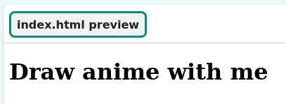
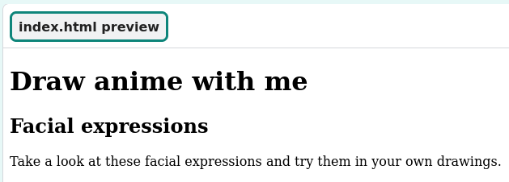

## Start your webpage

In this step, you will add a header and an introduction to your anime webpage.

<iframe src="https://staging-editor.raspberrypi.org/en/embed/viewer/anime-expressions-step-2" width="500" height="400" frameborder="0" marginwidth="0" marginheight="0" allowfullscreen> </iframe>

In HTML you can type words directly into the code to make the words appear, unformatted, on the webpage.

--- task ---

Open the [Anime expressions starter project](https://staging-editor.raspberrypi.org/en/projects/anime-expressions-starter){:target="_blank"}.

--- /task ---

--- task ---

Your starter project contains some HTML that you will learn more about throughout the project. 

To make your code easier to read, you can collapse the parts of it that you don't need right now. 

Click on the small triangle next to line 3 to collapse the `<head>`.

--- /task ---

### Add a header 

Typically, a webpage has three parts. A **header**, the **main** content, and a **footer**. 

--- task ---

You can use comments to organise your code and help people to understand the code. Comments are ignored by the web browser. 

**Find** the comment `<!-- The page header code goes here -->`.

--- collapse ---

---
title: I can't find the comment
---

Have you accidentally collapsed the `<body>` or another section of your webpage? 

Click on the ▸ triangle to expand the code.

--- /collapse ---

--- /task ---

HTML documents contain **elements** including paragraphs, headings, and images. An element is typically made up of a starting tag, some content, and a closing tag.

A **tag** lets the browser know what kind of element it is. Tags start and end with angle brackets `<>`. The end tag also has a `/`. 

--- task ---

Underneath the comment, find the `<header>` and `</header>` tags. Everything you add here appears in your webpage header and is styled as a header.

--- /task ---

A `<h1>` tag is used to say that this content is the largest header on the page. 

--- task ---

Add `<h1></h1>` **tags** inside your `<header></header>` tags.

**Tip:** When you add a start tag, the end tag is automatically added so you don't need to type it.

--- code ---
---
language: html
filename: index.html
line_numbers: true
line_number_start: 27
line_highlights: 30
---
  <body>
    <!-- The page header code goes here -->
    <header>
      <h1></h1>
    </header>

--- /code ---

**Tip:** It's a good idea to add spaces at the beginning of lines to indent your code. In HTML, you don’t need to add in the indents for the code to work, but it does make your code easier to read.  

--- /task ---

--- task ---

Add the text `Draw anime with me` between the two `<h1>` tags. 

--- code ---
---
language: html
filename: index.html
line_numbers: true
line_number_start: 27
line_highlights: 30
---
  <body>
    <!-- The page header code goes here -->
    <header>
      <h1>Draw anime with me</h1>
    </header>

--- /code ---

--- /task ---

--- task ---

**Test:** Some basic styling has been applied to the text because it is inside `<h1>` tags. The header text is bold and large. 

--- /task ---

### Add the first section in your main content

Any main content should be placed between the `<main>` tags. On your webpage, the main content is broken down into **sections**. 

--- task ---

Your webpage needs an introduction section. Add `<section></section>` tags between the `<main>` tags. 

**Tip:** As you build your webpage, you will add other tags inside your section. Position your cursor between the `<section>` and `</section>` tag, then press Enter on your keyboard to split the tags across multiple lines. 

--- code ---
---
language: html
filename: index.html
line_numbers: true
line_number_start: 33
line_highlights: 35-37
---
    <!-- The main content for the webpage goes between the main tags -->
    <main>
      <section>

      </section>
        <!-- The first drawing and instructions go here -->  

--- /code ---

--- /task ---

--- task ---

You are now going to add a subheading within the section that you have just created.

Add the subheading tags `<h2>` between the `<section>` tags.

--- code ---
---
language: html
filename: index.html
line_numbers: true
line_number_start: 33
line_highlights: 36
---
    <!-- The main content for the webpage goes between the main tags -->
    <main>
      <section>
        <h2></h2>
      </section>
        <!-- The first drawing and instructions go here --> 

--- /code ---

--- /task ---

--- task ---

Now enter the subheading text `Facial expressions` between the `<h2>` tags. Your code should look like this:

--- code ---
---
language: html
filename: index.html
line_numbers: true
line_number_start: 33
line_highlights: 36
---
    <!-- The main content for the webpage goes between the main tags -->
    <main>
      <section>
        <h2>Facial expressions</h2>
      </section>
        <!-- The first drawing and instructions go here --> 

--- /code ---

Notice how the text on your webpage is slightly smaller than the big heading above and has bold styling. This is because `<h2>` is a smaller heading than `<h1>`.

--- /task ---

--- task ---

You are now going to add a paragraph of text as an introduction to your anime webpage. 

Underneath your `<h2>` heading code, add the paragraph `
` tags. 

  --- code ---
  ---
  language: html
  filename: index.html
  line_numbers: true
  line_number_start: 33
  line_highlights: 37
  ---
    <!-- The main content for the webpage goes between the main tags -->
    <main>
      <section>
        <h2>Facial expressions</h2>
        

      </section>
        <!-- The first drawing and instructions go here --> 

--- /code ---

--- /task ---

--- task ---

Between the `
` tags, you need to add in this introductory text:

`Take a look at these facial expressions and try them in your own drawings.`

**Tip:** You can highlight the text above and then right-click (tap and hold on mobile) and choose 'Copy'. Then click between the `
` tags in your code and then right-click and choose 'Paste'.

Your code should look like this:

--- code ---
---
language: html
filename: index.html
line_numbers: true
line_number_start: 33
line_highlights: 37
---
    <!-- The main content for the webpage goes between the main tags -->
    <main>
      <section>
        <h2>Facial expressions</h2>
        
Take a look at these facial expressions and try them in your own drawings.

      </section>
        <!-- The first drawing and instructions go here --> 

--- /code ---

--- /task ---

--- task ---

**Test:** You can now see that the text appears under the subheading and uses the default paragraph styling. 

Well done! Your page now has a header, a subheading, and an introductory paragraph. 

--- /task ---

## Save your project

Your project is saved automatically. Return to the starter link in the same web browser to see your changes. 

--- collapse ---

---
title: I accidentally closed my web project
---

Click on the [starter project](https://staging-editor.raspberrypi.org/en/projects/anime-expressions-starter){:target="_blank"}. link to open your project. Use the same web browser to see your changes.

--- /collapse ---

--- collapse ---

---
title: If you have a Code Editor account
---

Click the 'Remix' button to create a copy of the project in your Raspberry Pi account. This means you can save a copy of the project.

--- /collapse ---
