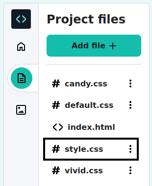

## Style your page

You have used HTML to add tags to your webpage. 

Now it is time to use CSS to add styles to your page. 

This step shows you how to change the colours, fonts, and layout on your webpage.   
  

<iframe src="https://staging-editor.raspberrypi.org/en/embed/viewer/anime-expressions-step-4" width="500" height="400" frameborder="0" marginwidth="0" marginheight="0" allowfullscreen> </iframe>

**Cascading Style Sheets (CSS)** is the language that you use to tell the web browser exactly how your webpage should look, which includes the positioning, colours, and fonts. We call this the style.

Every **rule** in CSS is made up of two parts: the **selector** and the **declaration**.

The **selector** is the part of HTML that you want to style. In this example it is `h1`. 

  <pre>h1 {
  color: blue;
  font-size: 12px;
}</pre>

 

The **declaration** is in curly brackets `{}`. It gives instructions of the styles that should be used. 

<pre>h1 {
  color: blue;
  font-size: 12px;
}</pre>

 

### Link the CSS file

The starter project includes CSS files, which contain a set of useful rules. 

--- task ---

Unfold the `<head>` section of your code so that you can view the code inside it.

--- /task ---

--- task ---

At the bottom of your `<head></head>` section, there are links to two CSS style sheets that are currently commented out so that they are ignored by the web browser. 

Remove the `<!--` and `-->` arrows from the start and end of both lines of link code:

**Before**

--- code ---
---
language: html
filename: index.html
line_numbers: true
line_number_start: 21
line_highlights: 23-24
---   
    <!-- Include CSS style file -->

    <!-- <link href="style.css" rel="stylesheet" type="text/css" /> -->
    <!-- <link href="candy.css" rel="stylesheet" type="text/css" /> -->
  </head>

--- /code ---

**After**

--- code ---
---
language: html
filename: index.html
line_numbers: true
line_number_start: 21
line_highlights: 23-24
---   
    <!-- Include CSS style file -->

    <link href="style.css" rel="stylesheet" type="text/css" />
    <link href="candy.css" rel="stylesheet" type="text/css" />
  </head>

--- /code ---
--- /task ---

--- task ---

**Test:** Click the **Run** button. 

HTML elements have default browser styles that you have seen as you have written your HTML code. 

Take a look at your webpage in the right-hand pane. Notice that the styles and layout of your output has now changed. 

**Tip:** To collapse the `<head>` section after you have seen the change, click the arrow next to it. 

--- /task ---

--- task ---

Click on the `Project files` icon in the Code Editor then select the `style.css` file top open in in a new tab.

This CSS file contains all of the CSS for your project. You will find out about some key parts of this CSS file as you create your webpage.

When you add CSS styling to an **element**, it applies that styling to every single element on the page that has the same tag. 

**Find:** Scroll down and find the rule that controls the style of the `<h2>`. 

--- code ---
---
language: css
filename: style.css
line_numbers: true
line_number_start: 109
line_highlights: 109-113
---  

h2 {
  font: var(--title-font); /* Font style stored in the title-font variable */
  text-align: left; /* Align the text */
  padding: 1.5rem; /* Add some space all around the heading */
}

--- /code ---

This rule states which font should be used, how the text should be aligned, and how much space should be around the header. 

--- /task ---

--- task ---

At the moment, the `<h2>` heading is aligned to the left.

Change the `text-align` property of the `h2` rule to `center`.

--- code ---
---
language: css
filename: style.css
line_numbers: true
line_number_start: 109
line_highlights: 111
---  

h2 {
  font: var(--title-font); /* Font style stored in the title-font variable */
  text-align: center; /* Align the text */
  padding: 1.5rem; /* Add some space all around the heading */
}

--- /code ---

--- /task ---

--- task ---

**Test:** Click the **Run** button. 

Look at your webpage and make sure the 'Facial expressions' text is centred. 

**Debug:** Check the spelling of the word `center`. HTML uses American (US) English spelling. 

<iframe src="https://staging-editor.raspberrypi.org/en/embed/viewer/anime-expressions-step-4" width="350" height="400" frameborder="0" marginwidth="0" marginheight="0" allowfullscreen> </iframe>

--- /task ---

